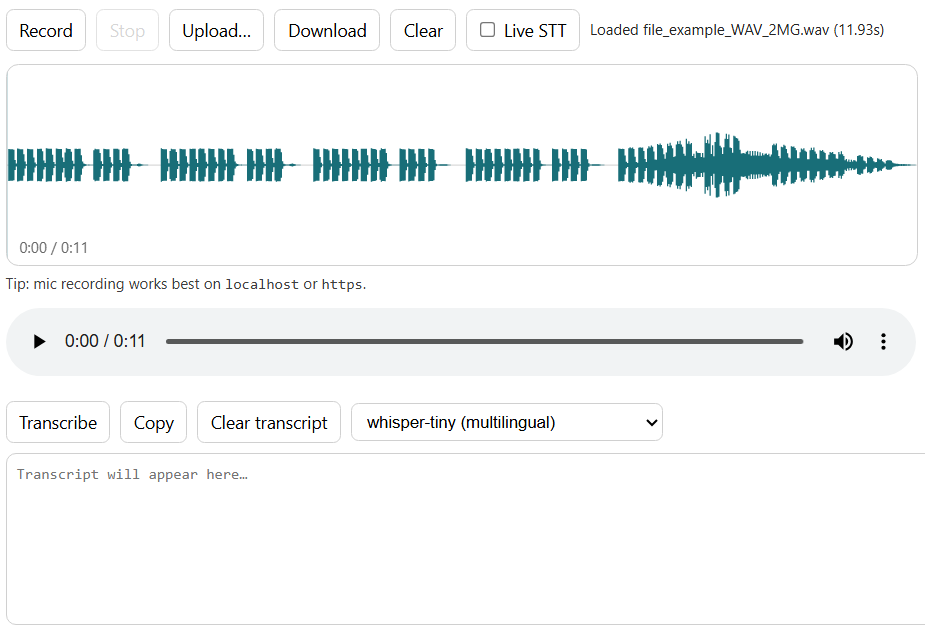

# Audio Pane

A small, local-first audio utility pane for **recording, previewing, and transcribing** audio directly in the browser.

## Features
- **Record from microphone** (with a live waveform preview)
- **Upload** audio files (`*.wav` recommended, but other formats may work)
- **Download** the current audio as a file
- **Waveform view** with click-to-seek
- **Offline-ish transcription (ASR)** via Transformers.js (Whisper / Wav2Vec2)
- **Live STT**: transcribe continuously while recording

## Notes
- Microphone recording typically requires running on `localhost` or `https`.
- Transcription models are fetched and cached by the browser (first run may take a while).
- Live STT runs in a Worker and down-samples to **16 kHz** for ASR compatibility.

## Files
- `audio.html` — UI layout
- `audio.css` — pane styling
- `audio.js` — recording, waveform rendering, and transcription logic (`mount/resume/suspend/unmount`)
