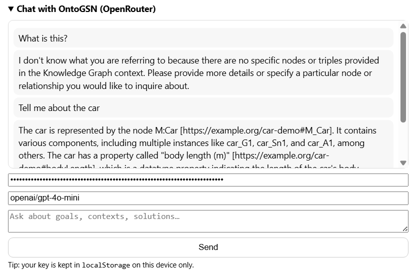

# Chat Pane

Minimal chat UI that connects **OntoGSN** to **OpenRouter** for asking questions about the currently loaded assurance-case graph.

## What it does
- Stores your OpenRouter API key + chosen model in `localStorage` (device-local only)
- Builds a small KG-aware context using SPARQL (`chat_context.sparql` + `chat_neighborhood.sparql`)
- Sends a non-streaming chat completion request to OpenRouter and renders the reply

## Events
- Listens: `left:tab` (focus input when activated)
- Listens: `chat:ask` (other panes can trigger a question)

## Files
- `chat.html` — UI layout
- `chat.css` — basic styling
- `chat.js` — context gathering + OpenRouter call + lifecycle (`mount/resume/suspend/unmount`)
