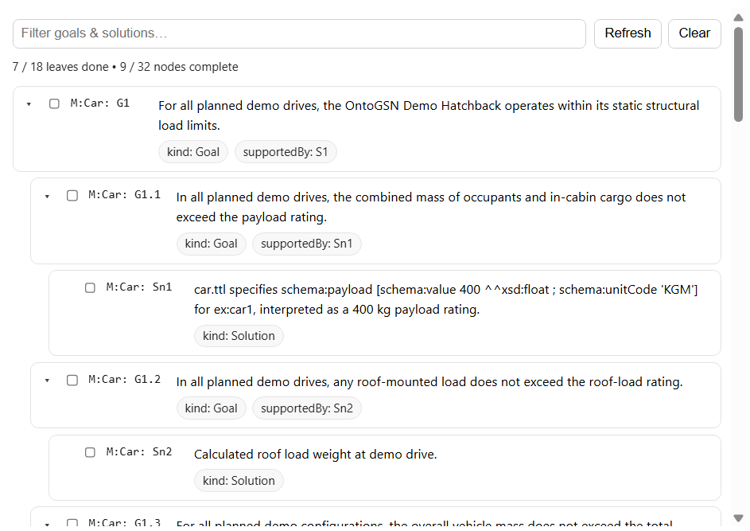

# Checklist Pane

A lightweight checklist view for OntoGSN goals/solutions, backed by SPARQL queries. It supports filtering, hierarchical expand/collapse, tri-state checkboxes, and persisting "done" status back into the RDF store.

## What it does
- Loads goals/solutions from SPARQL (including parent relationships)
- Renders a nested list with indentation + expand/collapse toggles
- Tri-state checkboxes (checked / indeterminate / unchecked) based on child completion
- Clicking a row emits a selection event for cross-pane navigation
- Stores collapsed state in `localStorage`
- Updates completion via SPARQL UPDATE (writes xyz:done boolean)

## Controls
- **Filter**: text search across id, module, statement, IRI, supportedBy
- **Refresh**: re-runs SPARQL queries and re-renders
- **Clear**: sets all nodes to done=false in the store

## Events
- Emits `checklist:select` with { iri } via:
  - pane bus: `bus.emit("checklist:select", { iri })`
  - window event: `window.dispatchEvent(new CustomEvent("checklist:select", ...))`

## Data dependencies
Files expected under `data/queries/`:
- `read_goalsForChecklist.sparql`
- `read_goalParentsForChecklist.sparql`
- `update_doneForChecklist.sparql`

## Pane lifecycle
Exports the standard PaneManager hooks:
- `mount({ root, bus })`
- `resume()` (refresh on focus)
- `suspend()`
- `unmount()`
