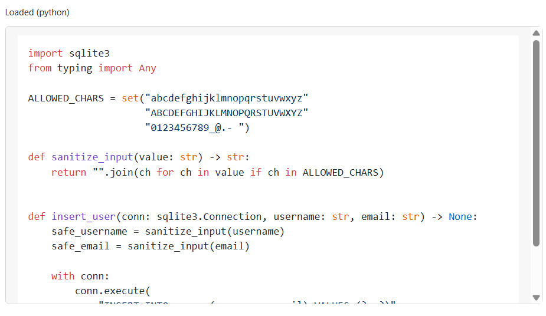

# Code Pane

Displays the source-code artefact linked to a selected OntoGSN Solution node.

## How it works
- Runs SPARQL query: `data/queries/read_solutionWithCode.sparql`
- Resolves `py:filePath` + language for a Solution IRI
- Fetches the referenced file from `data/` and renders it with syntax highlighting

## Interaction
- Default fallback IRI: `...#Sn11`
- Reacts to selection events:
  - bus event: `checklist:select` (expects `{ detail: { iri } }`)
- Shows status + error messages inline

## Pane lifecycle
Exports PaneManager hooks:
- `mount({ root, bus, payload })`
- `resume()` (reload current selection)
- `suspend()`
- `unmount()`
