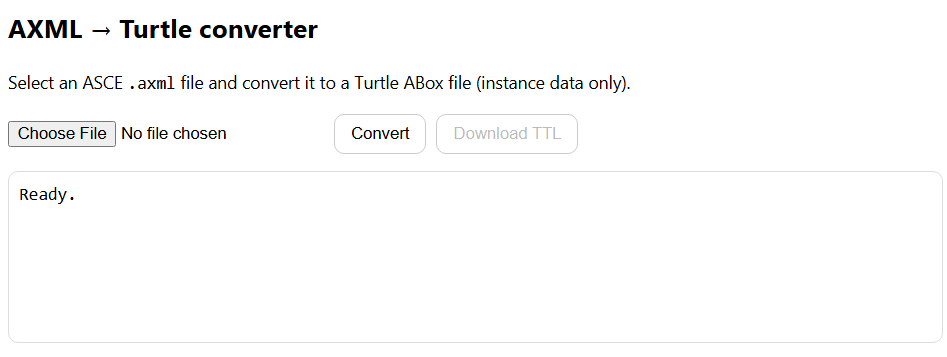

# Converter Pane

Client-side `AXML → Turtle` converter for ASCE/GSN exports. Converts a selected `.axml/.xml` file into a Turtle ABox (instance data) and lets you download the generated `.ttl`.

## Features
- Parses ASCE `Node` and `Link` elements into `asce:Node` / `asce:Link` individuals
- Extracts `userId`, `type`, and `userTitle` (or fallback text)
- Materializes direct edges:
  - type `1` → `gsn:supportedBy`
  - type `2` → `gsn:inContextOf`
- Optional `baseIri` override via pane payload

## Pane lifecycle
Exports PaneManager hooks:
- `mount({ root, payload })`
- `resume()`
- `suspend()`
- `unmount()`
