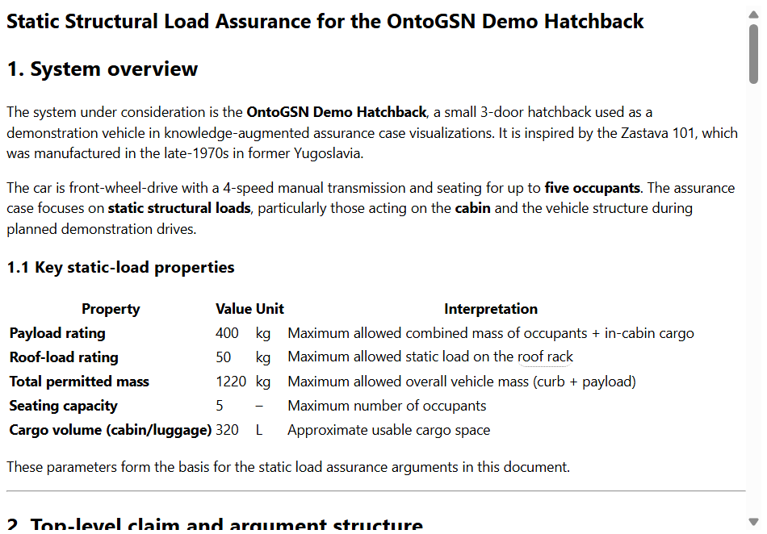

# Document Pane

Markdown document viewer with safe rendering and cross-pane highlighting. Loads docs either via SPARQL query results or direct paths, renders with `marked` + `DOMPurify`, and supports interactive ontology entity references.

## Features
- Open docs via bus event: `doc:open` (by `{ path }` or `{ queryPath, varHint }`)
- Highlight API via bus event: `doc:highlight` (selector / tag / headingId / text)
- Clear highlights via: `doc:clearHighlights`
- Entity links: markdown links starting with `$Tag` render as clickable buttons and show a tooltip from KG query `data/queries/read_documentEntity.sparql`
- Emits: `doc:loaded`, `ontogsndoc:entityClick`, `doc:hitDblClick`

## Pane lifecycle
Exports PaneManager hooks:
- `mount({ root })`
- `resume()`
- `suspend()`
- `unmount()`
