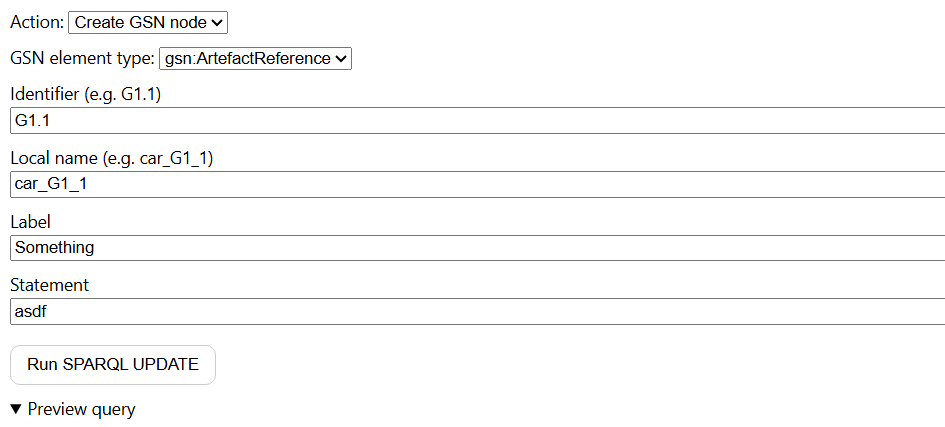

# Editor Pane

Minimal SPARQL UPDATE editor for writing to the local OntoGSN store. Provides a small set of pre-defined actions (template-based) to create/update GSN elements.

## How it works
- Action dropdown selects a SPARQL template (from `data/queries/`)
- GSN element types are loaded from `read_allowed_gsnElements.sparql`
- User fills fields, preview shows the final query, then executes via `app.runInline(...)`
- Emits `store:changed` on success so other panes can refresh

## Pane lifecycle
Exports PaneManager hooks:
- `mount({ root })`
- `resume()`
- `suspend()`
- `unmount()`
