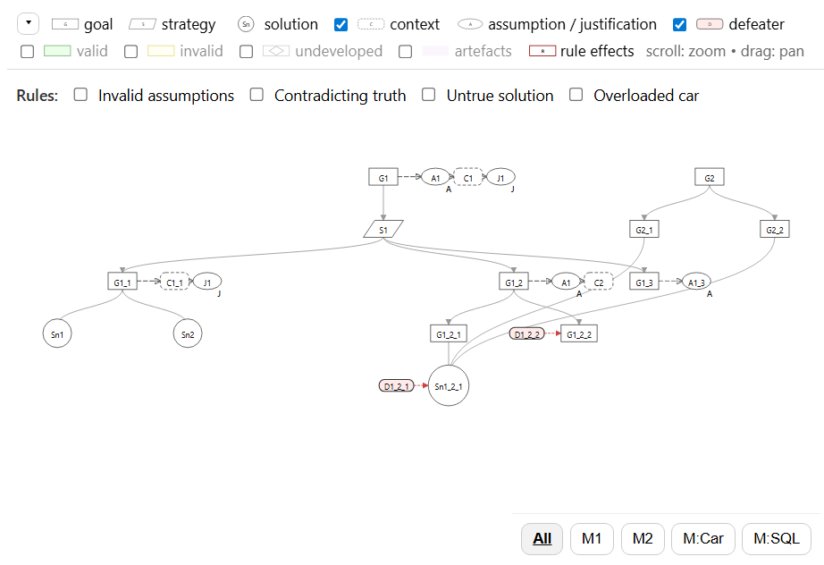

# Graph Pane

Interactive SVG renderer for OntoGSN/GSN graphs (DAG) using D3. Visualizes `supportedBy`, `inContextOf`, and `challenges` relations with pan/zoom, overlays, and rule-driven highlights.

## Features
- Renders nodes + edges from SPARQL `S/P/O` bindings
- Legend toggles for context/defeaters + overlay classes (valid/invalid/undeveloped/artefacts/rules)
- Rule checkboxes run one or multiple SPARQL queries to highlight effects
- Modules bar to filter visualization per module

## Events
Emits:
- `gsn:nodeClick`, `gsn:nodeDblClick`
- `gsn:contextClick`, `gsn:defeaterClick`
Listens:
- `right:tab` (re-render with requested query)
- `graph:highlight` / `graph:clearHighlights`

## Pane lifecycle
Exports PaneManager hooks:
- `mount({ root })`
- `resume()`
- `suspend()`
- `unmount()`
