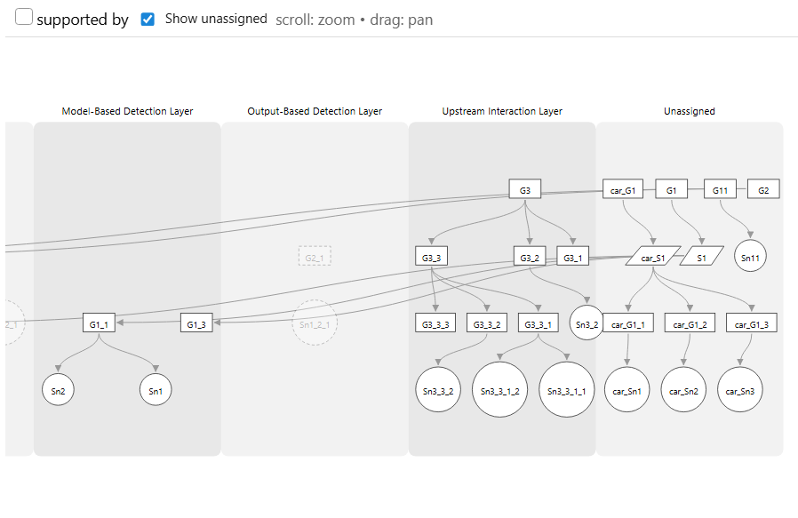

# Layers Pane

Swimlane-style view of a GSN graph, grouping nodes into ontology-defined “layers” (lanes). Uses D3 to render the same supportedBy structure as the Graph pane, but arranged per layer for easier comparison.

## How it works
- Fetches graph structure from `data/queries/visualize_graph.sparql`
- Fetches layer memberships from `data/queries/visualize_layers.sparql`
- Places nodes into one or more lanes via `assignLayers()` (extra placements become “ghost” nodes)

## UI
- Zoom/pan like the Graph pane
- Toggle `Show unassigned` (persisted in localStorage key `ontogsn_layers_show_unassigned_v1`)
- Optional “Unassigned” lane when a node has no layer membership

## Pane lifecycle
Exports PaneManager hooks:
- `mount({ root })`
- `resume({ root, payload })`
- `suspend()`
- `unmount()`
