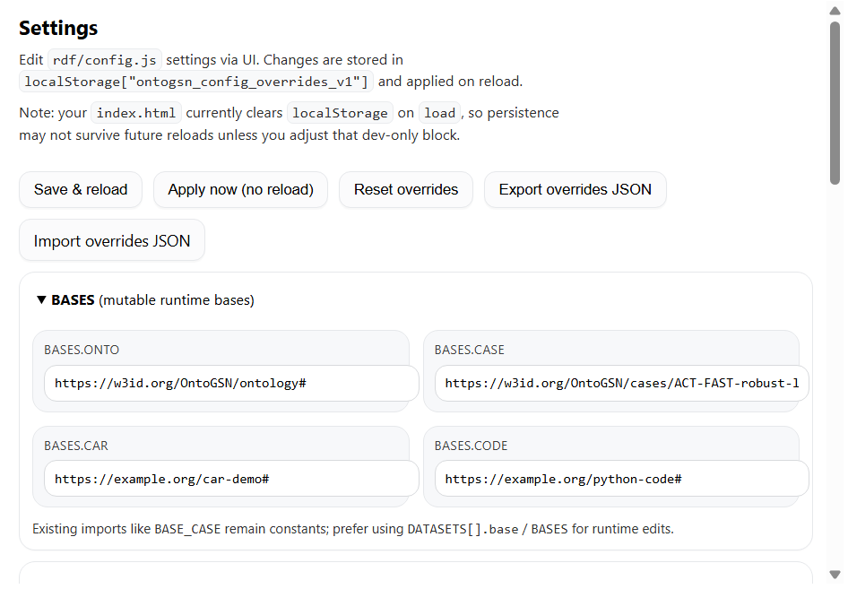

# Settings Pane

UI editor for runtime RDF configuration (`rdf/config.js`). Lets you override BASES, PATHS, and DATASETS, store overrides in localStorage, and apply them immediately or on reload.

## What it does
- Edit BASES and PATHS via input fields
- Manage DATASETS load order (enable/disable, add/remove rows)
- Save overrides to `localStorage[RUNTIME_CONFIG_KEY]`
- Export/import overrides as JSON

## Controls
- `Save & reload` — persists overrides and reloads the app (recommended for dataset changes)
- `Apply now` — applies in-memory without reload
- `Reset overrides` — clears stored overrides and reloads

## Exports
- Pane lifecycle: `mount`, `resume`, `suspend`, `unmount`
