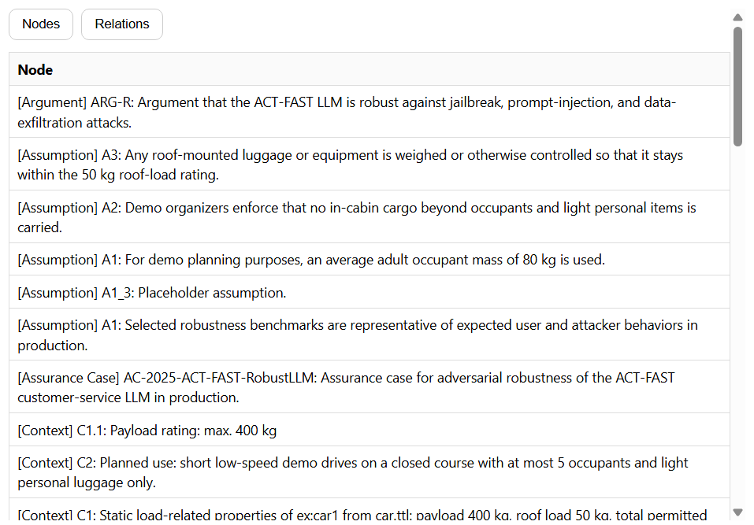

# Table Pane

Simple results viewer for SPARQL SELECT queries. Renders query bindings as an HTML table and supports quick actions (e.g., `Nodes` / `Relations`) via buttons.

## What it does
- Loads a SPARQL query file and runs it against `app.store`
- Converts bindings to display-friendly values
- Renders results as a table (or `No results.` / error message)

## Usage
- Click any element with `data-table-query` to run that query
- Can also be driven via bus events: `left:tab` / `right:tab` with `{ view: "table", query }`

## Exports
- Pane lifecycle: `mount`, `resume`, `suspend`, `unmount`
