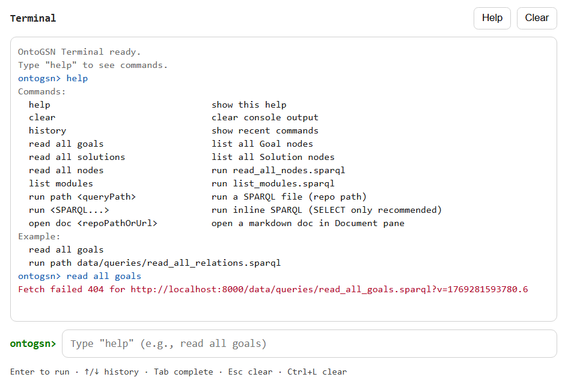

# Terminal Pane

Lightweight command-line UI for running common OntoGSN SPARQL queries and triggering app actions. Includes history, autocomplete, and a scrollable output log.

## What it does
- Executes built-in commands (e.g., `read all goals`, `list modules`) and prints results
- Runs SPARQL from a repo path (`run path ...`) or inline text (`run ...`)
- Opens docs in the Document pane via `open doc ...`
- Persists command history in `localStorage` and trims output to a safe limit

## Key bindings
- Enter run · ↑/↓ history · Tab complete · Esc clear input · Ctrl+L clear output

## Integration
- Listens to bus events: `terminal:print`, `terminal:run`, and focuses on terminal tab activation

## Exports
- Pane lifecycle: `mount`, `resume`, `suspend`, `unmount`
